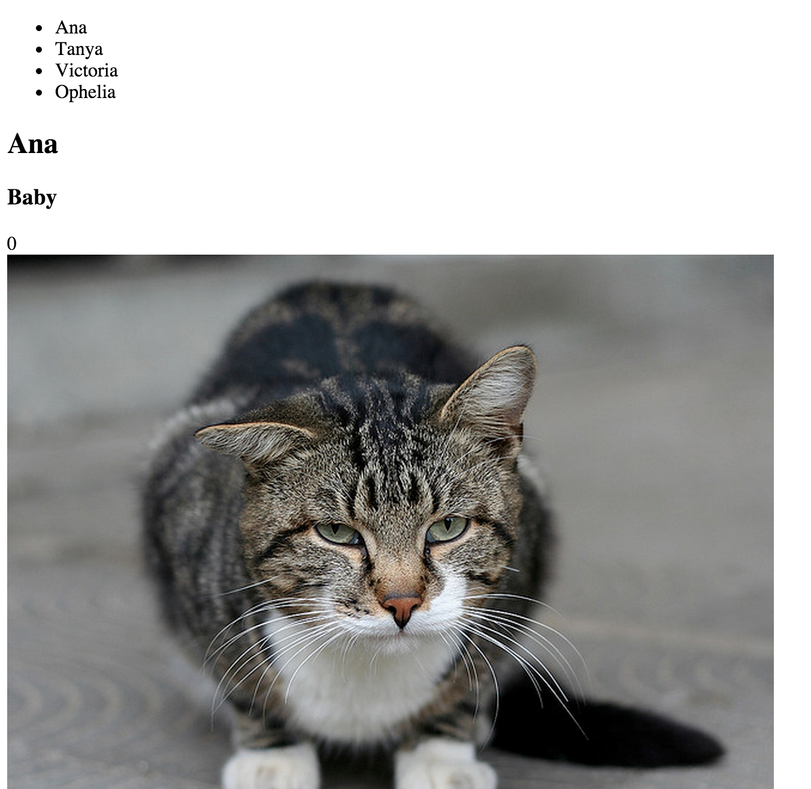

# Cat Clicker

By: Yaz Khoury

Built using Knockout.js, you can find the main page [here](http://knockoutjs.com/index.html). The following
screenshot is a preview of the Cat Clicker application.

Note that the focus was not on styling, so the application doesn't look that pretty. It was mainly focused on
writing the correct javascript using Knockout.js

> This application was built with the help of Udacity's Javascript Designs class. www.udacity.com

For contacting me, I can be reached at: yaz.khoury@gmail.com

